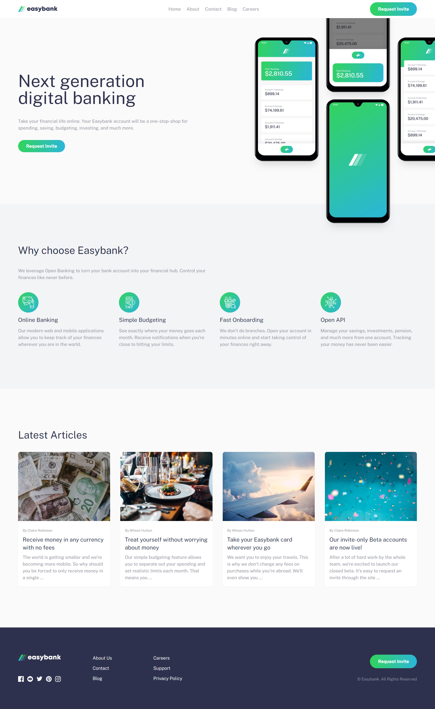
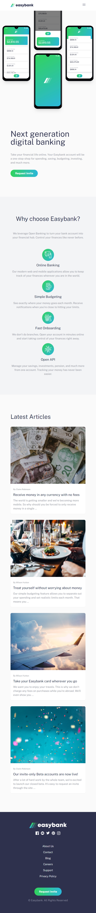
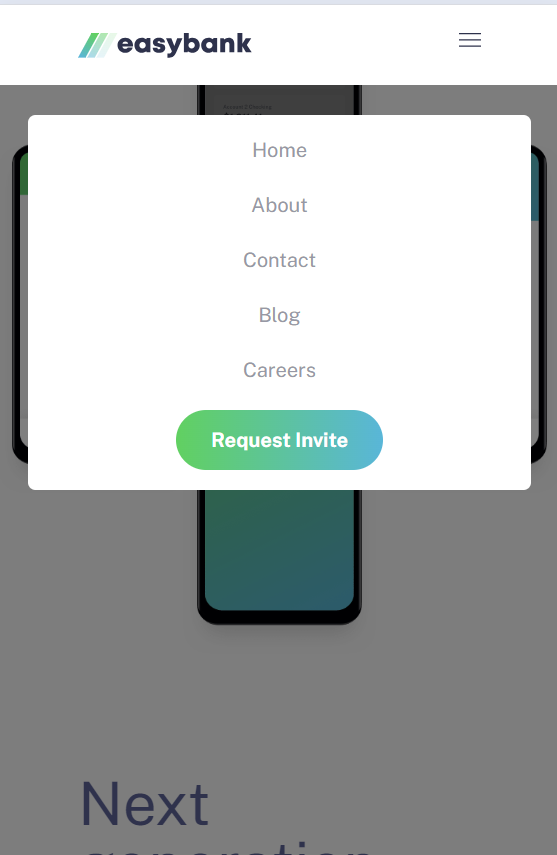

# Easybank landing page

This is a solution to the [Easybank landing page challenge on Frontend Mentor](https://www.frontendmentor.io/challenges/easybank-landing-page-WaUhkoDN).

## Table of contents

- [Overview](#overview)
  - [The challenge](#the-challenge)
  - [Screenshot](#screenshot)
  - [Links](#links)
- [My process](#my-process)
  - [Built with](#built-with)
- [Author](#author)

## Overview

### The challenge

Users is be able to:

- View the optimal layout for the site depending on their device's screen size
- See hover states for all interactive elements on the page

### Screenshot

#### Desktop

#### Mobile

#### Mobile open menu

### Links

- Solution URL: [atripunoska.github.io/easybank-landing-page/](https://atripunoska.github.io/easybank-landing-page/)

## My process

### Built with

- Semantic HTML5 markup
- [Tailwind](https://tailwindcss.com/)
- [AlpineJS](https://alpinejs.dev/)

## Author

- Website - [Ana Tripunoska](https://atripunoska.github.io/)
- Frontend Mentor - [@atripunoska](https://www.frontendmentor.io/profile/atripunoska)
